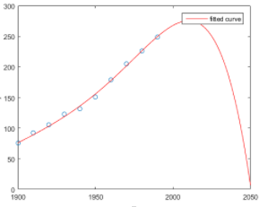

# Final Exam

### Q1) Consider deriving the probability of a coin flip coming up heads by running m trials of 100 flips each. If the coin is fair, the mean probability of the m trials will go to 0.5 as m goes to infinity.

- [x] True
- [ ] False

### Q2) Consider two normal distributions, A and B. The standard deviation of A is 3 and the standard deviation of B is 5. For each distribution, 1,000 observations are drawn and plotted in a histogram with 10 bins, creating one histogram for each distribution.

- [x] The rightmost bin of A will have fewer points than the rightmost bin of B. [INCORRECT!]
- [ ] The rightmost bin of B will have fewer points than the rightmost bin of A.
- [ ] The rightmost bin of A will have the same number of points as the rightmost bin of B.
- [ ] Any of the above are possible.

### Q3) You roll an unfair (weighted) die. The distribution of the numbers rolled is a uniform distribution.

- [ ] True
- [x] False

### Q4) A simulation

- [ ] is useful when describing a system that cannot easily be described mathematically.
- [ ] is easy to successively refine.
- [ ] can be used to extract intermediate results.
- [x] All of the above
- [ ] None of the above

### Q5) The following image plots the population of the US over time, along with a model fit to the data. This is an example of

- [x] overfitting
- [ ] underfitting

### Q6) If the R2 of a model produced using linear regression is 0.7, the model accounts for 70% of the variance in the observations.

- [x] True
- [ ] False

### Q7) Given a finite set of data points there exists a polynomial fit such that the polynomial curve goes through each point in the data.

- [ ] True
- [x] False

### Q8) You want to calculate confidence intervals by applying the empirical rule, which requires that you have a normal distribution with a known mean and standard deviation. Which approach can you use to estimate the mean and standard deviation that you need? Choose all that work.

- [x] Central Limit Theorem, which requires that you have many sufficiently large samples from the population
- [x] Standard Error, which requires that you have one sufficiently large sample

### Q9) You have a bucket with 4 red balls and 4 green balls. You draw 3 balls out of the bucket. Assume that once you draw a ball out of the bucket, you don't replace it. What is the probability of drawing 3 balls of the same color? Answer the question in reduced fraction form - eg 1/5 instead of 2/10.
> 1/7