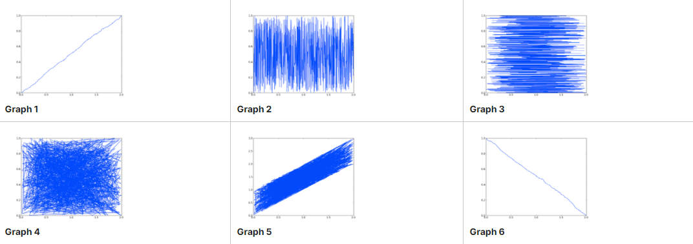

# Final Exam

### Problem 2
### Consider the following code:
```py
import random, pylab
xVals = []
yVals = []
wVals = []
for i in range(1000):
    xVals.append(random.random())
    yVals.append(random.random())
    wVals.append(random.random())
xVals = pylab.array(xVals)
yVals = pylab.array(yVals)
wVals = pylab.array(wVals)
xVals = xVals + xVals
zVals = xVals + yVals
tVals = xVals + yVals + wVals
```


### For each of the following questions, select the best answer from the set of choices.

### Q1) The values in tVals are most closely:

- [ ] Uniformly distributed
- [x] Distributed with a Gaussian distribution
- [ ] Exponentially distributed


## Q2) The values in xVals are most closely:

- [x] Uniformly distributed
- [ ] Distributed with a Gaussian distribution
- [ ] Exponentially distributed

### For each of the following expressions using the code above, match the following calls to pylab.plot with one of the graphs shown below.


### Q3)
```py
pylab.plot(xVals, zVals)
```
- [ ] Graph 1
- [ ] Graph 2
- [ ] Graph 3
- [ ] Graph 4
- [x] Graph 5
- [ ] Graph 6


### Q4)
```py
pylab.plot(xVals, yVals)
```
- [ ] Graph 1
- [ ] Graph 2
- [ ] Graph 3
- [x] Graph 4
- [ ] Graph 5
- [ ] Graph 6


### Q5)
```py
pylab.plot(xVals, sorted(yVals))
```
- [ ] Graph 1
- [ ] Graph 2
- [x] Graph 3
- [ ] Graph 4
- [ ] Graph 5
- [ ] Graph 6


### Q6)
```py
pylab.plot(sorted(xVals), yVals)
```
- [ ] Graph 1
- [x] Graph 2
- [ ] Graph 3
- [ ] Graph 4
- [ ] Graph 5
- [ ] Graph 6


### Q7)
```py
pylab.plot(sorted(xVals), sorted(yVals))
```
- [x] Graph 1
- [ ] Graph 2
- [ ] Graph 3
- [ ] Graph 4
- [ ] Graph 5
- [ ] Graph 6

