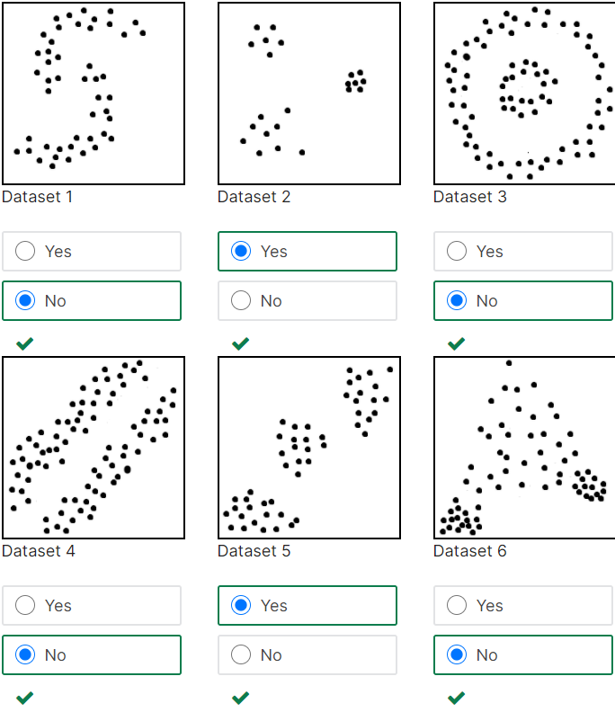

# Final Exam
### Problem 5

### K-means is a greedy algorithm, meaning it looks for local minimum when choosing points closest to the centroid. For each dataset illustrated below, will k-means, as shown in lecture, using Euclidean distance as the metric be able to find clusters that match the dataset patterns?

