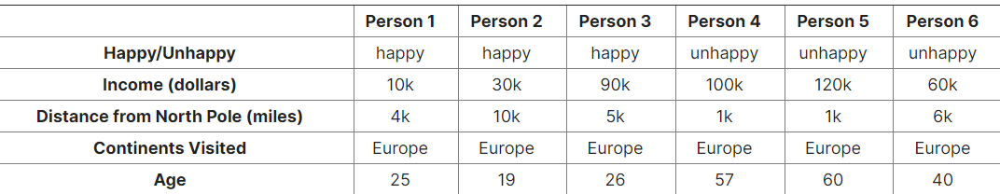

# Final Exam
### Problem 7

### Answer the next questions on machine learning, related to the following data. Consider the following 6 people who are either happy or unhappy and the data we know on them:

### Q1) Using the Manhattan distance and looking only at "Income" and "Distance from North Pole", which two people are closest and farthest?

- [ ] closest: Person 1 and Person 2 ||| farthest: Person 4 and Person 5
- [x] closest: Person 4 and Person 5 ||| farthest: Person 1 and Person 5[INCORRECT! (DONT KNOW WHY?)]
- [ ] closest: Person 4 and Person 5 ||| farthest: Person 5 and Person 6
- [ ] closest: Person 3 and Person 4 ||| farthest: Person 5 and Person 6
- [ ] closest: Person 3 and Person 4 ||| farthest: Person 1 and Person 5

### Q2) If we were to cluster the people, the inclusion/exclusion of which feature would never impact the final clusters?

- [ ] Happy/Unhappy
- [ ] Income
- [ ] Distance from North Pole
- [x] Continents Visited
- [ ] Age