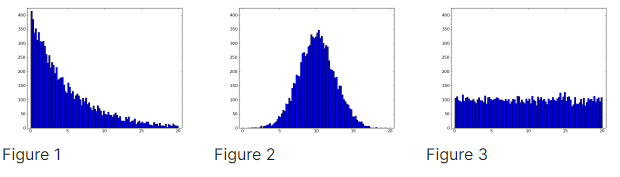

## Finger Exercise 6
### Samples were taken from a distribution, and the histogram of those samples is shown here:

### Q1) Which of the following distributions were the samples taken from?

- [ ] Uniform Distribution
- [ ] Exponential Distribution
- [x] Normal Distribution

### Q2) Which of the following histograms best matches samples taken from a uniform distribution between 0 and 2?

- [ ] Figure 1
- [x] Figure 2
- [ ] Figure 3
- [ ] Figure 4

### Q3) Each of the following histograms was generated by sampling a different normal distribution. Which histogram best matches the normal distribution with the highest variance of the three?

- [ ] Figure 1
- [ ] Figure 2
- [x] Figure 3

### Q4) Mary's Clothes Shoppe is a moderatly busy store. Which of the following histograms best matches observations of how much time (in minutes) there is between customer arrivals? That is, which histogram helps best predict how much time until the next customer comes into the Clothes Shoppe.
For each histogram, 1000 observations were made. The x-axis is measured in minutes, and the height of each bar at minute m corresponds to how many times there was an m minute wait until the next customer arrived.

- [x] Figure 1
- [ ] Figure 2
- [ ] Figure 3