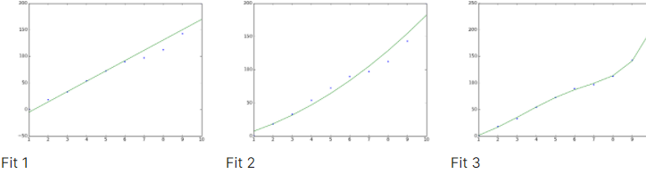

## Finger Exercise 2
### Suppose you are given the following data and are asked to fit a curve to this data.

### A = [1,2,3,4,5,6,7,8,9,10]
### L = [0.59,18.38, 33.01, 54.14, 72.48, 89.8, 97.07, 112.6, 142.87, 199.84]
  
### Match each plot with the correct polynomial fit.

- [x] Linear                   - [ ] Linear                  - [ ] Linear
- [ ] Polynomial of degree 2   - [x] Polynomial of degree 2  - [ ] Polynomial of degree 2
- [ ] Polynomial of degree 5   - [ ] Polynomial of degree 5  - [x] Polynomial of degree 5

<!-- linear
Fit 1

Linear

correct
smooth polynomial
Fit 2

Linear
Polynomial of degree 2
Polynomial of degree 5
correct
looks linear until x=6 then dips down then back up
Fit 3

Linear
Polynomial of degree 2
Polynomial of degree 5
correct
Is each fit an example of overfitting?

linear
Fit 1

Yes
No
correct
smooth polynomial
Fit 2

Yes
No
correct
looks linear until x=6 then dips down then back up
Fit 3

Yes
No
correct
Show answer -->