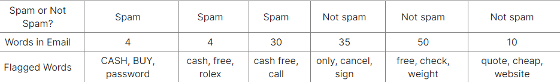

## Finger Exercise 2

### For the following question, check the boxes that correspond to the rules that we may be able to learn. Consider the following set of 6 emails, which classify the email as spam or not. Which of the following rules might we learn? Check all that apply.

- [x] Emails containing both flagged words "cash" and "free" are marked "spam".
- [ ] Emails without the flagged word "free" are marked "not spam".
- [ ] Emails with an even number of words are marked "spam".
- [ ] Emails with less than 31 words are marked "spam".
- [x] Emails containing at least one flagged word in all capital letters are marked "spam".