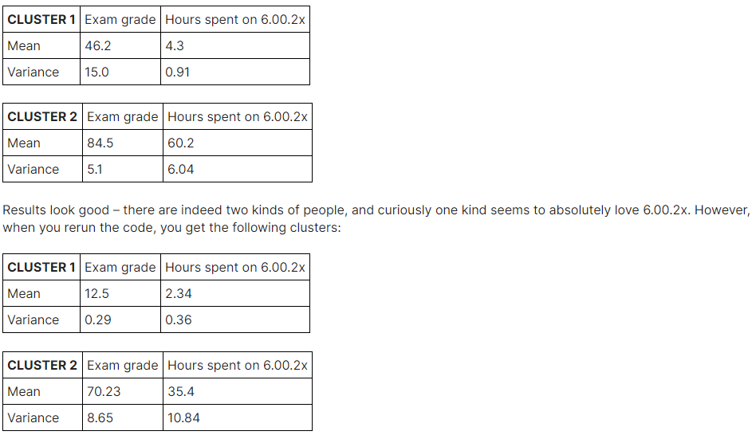

## Finger Exercise 5

### As Professor Guttag said, there are two types of people in this world: those who know programming and those who don’t. To prove this once and for all, you take a random sampling of edX students and put them through a programming test. Assume that the test is entirely fair and that it reflects the exact level of skill each student has. You also ask them to fill out a small questionnaire about their experience with 6.00.2x.

### You receive the results for each student as [Exam grade, Hour spent on 6.00.2x]. That is, if Alice has spent 90 hours on 6.00.2x and received a score of 74 on the exam, you will have [74, 90] as a data point.

### Q1) Based on your initial purposes, what should you choose as k?
- [x] 2
- [ ] 3
- [ ] 4

### Q2) Should you apply scaling to this data?
- [x] Yes
- [ ] No

### You run your clustering algorithm and get two clusters:

### Q3) You don’t know what to believe (and, indeed, there’s no reason for you to choose one over another). What can you do to fix this and get a stable result?
- [x] Let k = 3
- [ ] Add more students
- [ ] Add "student name length" as a feature