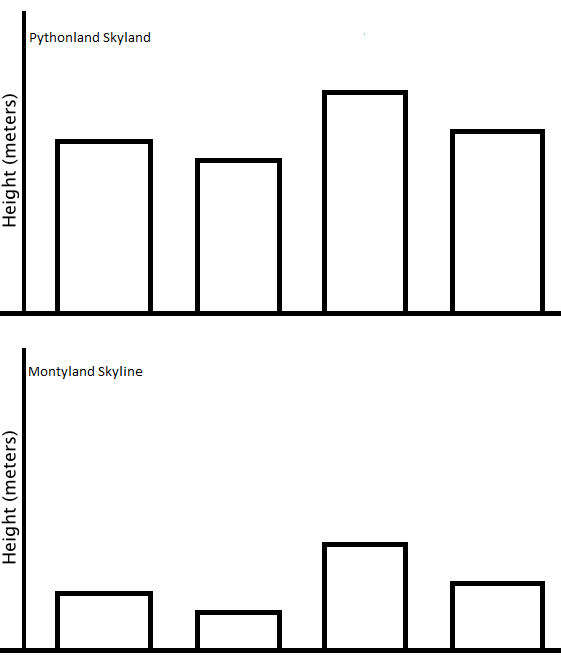

## Finger Excercise 4

### *The coefficient of variation is the standard deviation divided by the mean. Loosely, it's a measure of how variable the population is in relation to the mean.*

### Figure 1 shows the skyline of Pythonland, and Figure 2 shows the skyline of Montyland.

### Q1) Considering the heights of buildings in Pythonland and Montyland, which has a larger coefficient of variation?

- [ ] Pythonland
- [x] Montyland

### Q2) Which of the following populations has the highest coefficient of variation?

- [x] [1, 2, 3]
- [ ] [11, 12, 13]
- [ ] [0.1, 0.1, 0.1]

### Q3) Compute the coefficient of variation of [10, 4, 12, 15, 20, 5] to 3 decimal places.
>0.503