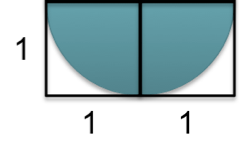

## Finger Excercise 3
### If you remember the Buffon Needle Problem, the ratio of the areas of a circle and a square are used to estimate the value of  π  by dropping needles onto the shapes, like so:

### π=(area of square)(needles in circle)/needles in square 
### We can imagine that using different area ratios results in the estimation of different constants.

### In the following boxes, you will be asked to enter in mathematical expressions. To enter in addition, multiplication, subtraction, or division, use the operators: +, *, -, /. To enter in exponentiation, use the caret (^) key. To enter in the constant  π , simply type pi.

### Q1) What constant can you estimate using the following picture?

> 

### Q2) Download the code used in the lecture "Finding Pi". If we now want to estimate the constant from the picture above, what should the number '4' in the line: return 4*(inCircle/float(numNeedles)) be changed to?

> 