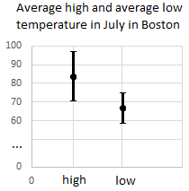

## Finger Excercise 3

### The following image shows the average low and average high temperature in from the data in `julytemps.txt`.

### vertical bar 1 with top at 95 and bottom at 70 and midpoint at 82 and vertical bar 2 with top at 75 and bottom at 59 and midpoint at 65
### The errorbars represent the 95% confidence interval. The 95% confidence interval for the average high is 83.5 +/- 12.9 and the 95% confidence interval for the average low is 67.2 +/- 7.3. 

### Q1) Are these two means statistically significant at the 95% confidence interval?

- [ ] Yes
- [x] No

### Q2) Are these two means statistically significant at the 99.7% confidence interval?

- [ ] Yes
- [x] No

### Q3) Are these two means statistically significant at the 68% confidence interval?

- [x] Yes
- [ ] No