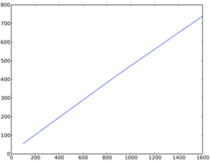

## Now, you'll use your simulation to answer some questions about the robots' performance.

### In order to do this problem, you will be using a Python tool called PyLab. 

### Below is an example of a plot. This plot does not use the same axes that your plots will use; it merely serves as an example of the types of images that the PyLab package produces.

### Note to those who did the optional visualization: For problem 6, we make calls to runSimulation() to get simulation data and plot it. However, you don't want the visualization getting in the way. If you chose to do the visualization exercise, before you get started on problem 6 (and before you submit your code in submission boxes), make sure to comment the visualization code out of runSimulation(). There should be 3 lines to comment out. If you do not comment these lines, your code will take a REALLY long time to run!!

### For the questions below, call the given function with the proper arguments to generate a plot using PyLab.

## Problem 6-1
### Examine showPlot1 in ps2.py, which takes in the parameters title, x_label, and y_label. Your job is to examine the code and figure out what the plot produced by the function tells you. Try calling showPlot1 with appropriate arguments to produce a few plots. Then, answer the following 3 questions.

### Which of the following would be the best title for the graph?

### Q6.1.1) Percentage Of Room That A Robot Cleans?
- [ ] Time It Takes 1 - 10 Robots To Clean 70% Of A Room
- [ ] Percentage Of Room That 1 - 10 Robots Clean
- [x] Time It Takes 1 - 10 Robots To Clean 80% Of A Room
- [ ] Time For Robots To Clean Varying Percentages Of A Room
- [ ] Area Of Room That 1 - 10 Robots Clean

### Q6.1.2) Which of the following would be the best x-axis label for the graph?

- [ ] Time-steps
- [ ] Percentage Cleaned
- [ ] Aspect Ratio
- [x] Number of Robots
- [ ] Distance Travelled

### Q6.1.3) Which of the following would be the best y-axis label for the graph?

- [x] Time-steps
- [ ] Percentage Cleaned
- [ ] Aspect Ratio
- [ ] Number of Robots
- [ ] Distance Travelled

## Problem 6-2
### Examine showPlot2 in ps2.py, which takes in the parameters title, x_label, and y_label. Your job is to examine the code and figure out what the plot produced by the function tells you. Try calling showPlot2 with appropriate arguments to produce a few plots. Then, answer the following 3 questions.

### Q6.2.1) Which of the following would be the best title for the graph?

- [ ] Percentage Of Room That A Robot Cleans
- [ ] Time It Takes Two Robots To Clean 80% Of Variously Sized Rooms
- [x] Time It Takes Two Robots To Clean 80% Of Variously Shaped Rooms
- [ ] Time It Takes 1 - 10 Robots To Clean 80% Of A Room
- [ ] Percentage Of Variously Sized Rooms That A Robot Cleans
- [ ] Percentage Of Variously Shaped Rooms That A Robot Cleans

### Examine showPlot2 in ps2.py, which takes in the same parameters as showPlot1. Your job is to examine the code and figure out what the plot produced by the function tells you. Try calling showPlot2 with appropriate arguments to produce a few plots. Then, answer the following 3 questions.

### Q6.2.2) Which of the following would be the best x-axis label for the graph?

- [ ] Time-steps
- [ ] Percentage Cleaned
- [x] Aspect Ratio
- [ ] Number of Robots
- [ ] Distance Travelled

### Q6.2.3) Which of the following would be the best y-axis label for the graph?

- [x] Time-steps
- [ ] Percentage Cleaned
- [ ] Aspect Ratio
- [ ] Number of Robots
- [ ] Distance Travelled

